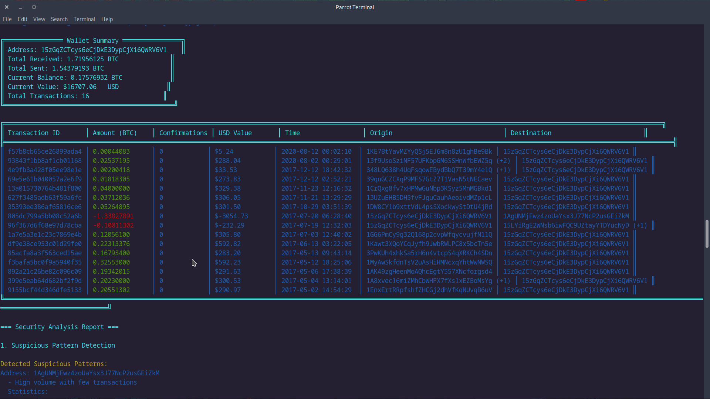

# Bitcoin Wallet Monitor

This Go-based Bitcoin Wallet Monitor fetches detailed information about a Bitcoin wallet's transactions and analyzes its patterns. It provides a detailed report on the wallet's current status, including:

- Transaction details including amounts, origins, destinations, and timestamps
- Analysis of unusual transaction patterns
- Volume analysis and temporal patterns
- Detection of rapid or high-volume transactions




## Features

- Fetch and display a Bitcoin wallet’s summary (Total Received, Total Sent, Final Balance).
- Detailed analysis of each transaction:
  - Amount in BTC and USD.
  - Transaction origin and destination addresses.
  - Confirmations and timestamp.
- Detects suspicious patterns such as:
  - Unusual transaction volumes.
  - Frequent transactions within short time windows.
- Fetch real-time price data from APIs (fallback to local database if API is rate is reached).
- Generates detailed analysis and reports for security purposes.

## Prerequisites

To use this tool, you need the following:

1. Go installed on your local machine (Go version 1.18 or above).
2. A Bitcoin wallet address to monitor.


### Libraries and Dependencies

The following libraries are used:

- `github.com/mattn/go-sqlite3`: SQLite3 database driver for Go.
- `net/http`: To handle API requests and responses.
- `encoding/json`: To parse and generate JSON data.
- `fmt`, `log`: For standard logging and formatted printing.

## Setup

1. Clone the repository:
    ```bash
    git clone https://github.com/your-username/bitcoin-wallet-monitor.git
    cd bitcoin-wallet-monitor
    ```

2. Install Go dependencies:
    ```bash
    go mod tidy
    ```

3. Ensure that you have an SQLite database (`btcprice.db`) with the historical price data of Bitcoin for fallback.

## Usage

### Run the Application

To run the program and monitor a wallet, use the following command:

```bash
go run main.go -wallet <your_bitcoin_wallet_address>


#
